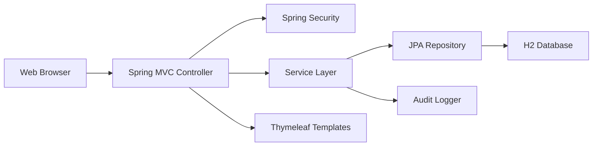

# UsedCarrot 개발 보고서

- GitHub 공개 저장소: <https://github.com/no-carve-only-pizza/usedcarrot>

## 1. 과제 요약

### 1.1 프로젝트명

- UsedCarrot
- Tiny Second-hand Shopping Platform

### 1.2 프로젝트 목적

UsedCarrot은 사용자가 중고 상품을 등록하고, 상품을 검색 및 조회하며, 판매자와 1:1 채팅을 통해 거래할 수 있는 웹 기반 중고거래 플랫폼이다. 프로젝트는 기능 구현뿐 아니라 인증, 인가, 입력값 검증, 파일 업로드 보안, XSS 방어, SQL Injection 방어, 감사 로그 등 보안 요구사항을 함께 만족하는 것을 목표로 한다.

### 1.3 기술 스택

| 구분 | 사용 기술 |
| --- | --- |
| Backend | Java 21, Spring Boot 3 |
| View | Thymeleaf |
| Security | Spring Security, BCrypt |
| Database | H2, Spring Data JPA |
| Validation | Jakarta Bean Validation |
| Test | JUnit 5, Spring Boot Test |
| Build | Gradle |

## 2. 요구사항 분석

### 2.1 최소 요구사항 대응

| 요구사항 | 구현 기능 | 구현 위치 |
| --- | --- | --- |
| 회원가입/로그인/로그아웃 | 이메일 기반 회원가입, Spring Security 세션 로그인, 로그아웃 | `auth`, `config/SecurityConfig.java` |
| 마이페이지 | 본인 프로필 조회/수정, 비밀번호 변경 | `user/controller/UserController.java` |
| 상품 등록/조회/수정/삭제 | 상품 CRUD, 목록/상세 화면, 이미지 업로드 | `product` |
| 상품 검색 | 키워드, 카테고리 검색 | `ProductRepository.searchVisible` |
| 1:1 채팅 | 상품별 구매자-판매자 채팅방, 메시지 전송 | `chat` |
| 신고 | 상품/사용자 신고, 중복 신고 제한 | `report` |
| 악성 상품/사용자 제한 | 상품 신고 3회 숨김, 사용자 신고 5회 제한/10회 정지 | `ReportService` |
| CarrotCoin 거래 | DB 기반 모의지갑 구매, 거래 내역, 멱등성 키 | `wallet` |
| 관리자 기능 | 사용자, 상품, 신고, 감사 로그 관리 | `admin`, `Admin*Controller` |

### 2.2 범위 조정

- 전체 공개 채팅은 악용 가능성과 최소 요구사항 우선순위를 고려하여 제외하고, 상품별 1:1 채팅을 구현했다.
- CarrotCoin은 실제 가상자산 네트워크와 연동하지 않고 DB 내부 `Wallet`, `WalletTransaction` 기반 모의지갑으로 구현했다.
- H2 콘솔은 개발 편의 기능이지만 DB 노출 위험이 있어 기본 비활성화했다.

## 3. 시스템 설계

### 3.1 아키텍처

UsedCarrot은 서버 렌더링 방식의 Spring Boot MVC 애플리케이션이다. 사용자는 Thymeleaf 화면을 통해 요청을 보내고, 컨트롤러는 인증 정보와 DTO 검증 결과를 바탕으로 서비스 계층을 호출한다. 서비스 계층은 비즈니스 규칙과 권한 검증을 수행하며, JPA Repository를 통해 H2 데이터베이스에 접근한다.



### 3.2 주요 화면

| 화면 | 경로 | 목적 | 접근 권한 |
| --- | --- | --- | --- |
| 홈 | `/` | 최신 상품 표시, 검색/등록 진입 | 전체 |
| 회원가입 | `/register` | 신규 사용자 등록 | 비회원 |
| 로그인 | `/login` | 세션 로그인 | 전체 |
| 상품 목록 | `/products` | 상품 검색 및 목록 조회 | 전체 |
| 상품 상세 | `/products/{id}` | 상품 정보, 문의, 구매, 신고 | 전체 |
| 상품 등록/수정 | `/products/new`, `/products/{id}/edit` | 상품 등록/수정 | 회원/소유자 |
| 채팅 | `/chat`, `/chat/{roomId}` | 1:1 채팅 목록/대화 | 참여자 |
| 지갑 | `/wallet` | 잔액 및 거래 내역 | 본인 |
| 관리자 | `/admin/**` | 사용자/상품/신고/로그 관리 | 관리자 |

### 3.3 데이터베이스 설계

| 테이블 | 목적 | 보안상 주요 포인트 |
| --- | --- | --- |
| `users` | 사용자 계정 저장 | `email`, `nickname` unique, `password_hash`만 저장 |
| `products` | 상품 정보 저장 | 판매자 FK, 상태값으로 숨김/삭제 관리 |
| `product_images` | 상품 이미지 메타데이터 저장 | UUID 저장명, 원본 파일명 분리 |
| `favorites` | 관심 상품 저장 | 사용자-상품 unique |
| `chat_rooms` | 상품별 1:1 채팅방 | 상품-구매자-판매자 unique |
| `messages` | 채팅 메시지 저장 | 참여자만 조회/전송 |
| `wallets` | CarrotCoin 잔액 저장 | 사용자별 unique, 음수 방지 로직 |
| `wallet_transactions` | CarrotCoin 거래 내역 | `transaction_hash`, `idempotency_key` unique |
| `reports` | 신고 내역 저장 | 24시간 중복 신고 제한 |
| `audit_logs` | 보안 감사 로그 | 비밀번호/토큰/세션 ID 기록 금지 |

## 4. 구현 내용

### 4.1 사용자 관리

회원가입 시 이메일, 비밀번호, 닉네임, 지역을 입력받고 서버 측에서 형식과 길이를 검증한다. 이메일과 닉네임은 중복을 허용하지 않는다. 비밀번호는 BCrypt로 해시하여 `password_hash`에 저장하며, 평문 비밀번호는 DB와 로그에 남기지 않는다.

로그인은 Spring Security의 세션 기반 인증을 사용한다. 로그인 실패 메시지는 “이메일 또는 비밀번호가 올바르지 않습니다.”로 일반화했다. 로그인 실패 횟수를 사용자 엔티티에 기록하고, 5회 이상 실패 시 5분간 잠금 상태가 되도록 구현했다.

### 4.2 상품 관리

회원은 상품명, 설명, 가격, 지역, 카테고리, 이미지를 등록할 수 있다. 상품 가격은 0 이상 100,000,000 이하로 제한하고, 설명은 최대 2,000자로 제한한다. 판매자는 본인 상품만 수정/삭제할 수 있고, 삭제는 물리 삭제가 아니라 `DELETED` 상태 변경으로 처리한다.

상품 목록과 검색에서는 `HIDDEN`, `DELETED`, `SOLD` 상품을 기본 노출에서 제외한다. 상품 상세 조회 시 조회수가 증가한다.

### 4.3 이미지 업로드

이미지는 jpg, jpeg, png, webp만 허용한다. 확장자, MIME 타입, 파일 크기, 파일 시그니처를 모두 검증한다. 저장 파일명은 UUID로 생성하여 원본 파일명을 직접 사용하지 않는다.

업로드 파일은 정적 경로로 직접 노출하지 않고 `/uploads/{storedFileName}` 컨트롤러를 통해 제공한다. 이 컨트롤러는 DB에서 이미지와 상품 상태를 확인한 뒤, 숨김/삭제 상품 이미지는 일반 사용자에게 노출하지 않는다.

### 4.4 채팅

상품별로 구매자와 판매자 사이에 1:1 채팅방을 생성한다. 같은 구매자가 같은 상품에 다시 문의하면 기존 채팅방을 재사용한다. 채팅방 참여자가 아니면 채팅방과 메시지를 조회할 수 없다. 메시지는 1~1,000자 제한을 적용하고 Thymeleaf `th:text`로 출력하여 XSS를 방어한다.

### 4.5 신고 및 제재

회원은 상품 또는 사용자를 신고할 수 있다. 본인 상품 신고와 자기 자신 신고는 차단한다. 같은 사용자가 같은 대상을 24시간 내 반복 신고하는 것도 차단한다.

신고 누적 정책은 다음과 같다.

| 대상 | 기준 | 처리 |
| --- | --- | --- |
| 상품 | 신고 3회 이상 | `HIDDEN` 처리 |
| 사용자 | 신고 5회 이상 | `LIMITED` 처리 |
| 사용자 | 신고 10회 이상 | `SUSPENDED` 처리 |

### 4.6 CarrotCoin 모의지갑

CarrotCoin은 실제 가상자산 결제 서비스가 아니라 DB 기반 모의지갑 시스템이다. 실제 블록체인, 개인키, 지갑 주소, 외부 결제 API는 사용하지 않는다.

회원가입 시 사용자별 지갑을 자동 생성하고 초기 잔액 1,000,000 CarrotCoin을 지급한다. 상품 구매 시 서버에 저장된 상품 가격을 기준으로 구매자 지갑 잔액을 차감하고 판매자 지갑 잔액을 증가시킨다. 거래 완료 후 상품 상태는 `SOLD`로 변경된다.

중복 구매 방지를 위해 `idempotencyKey`를 unique로 저장한다. 기존 키가 들어온 경우 구매자와 상품이 같은 요청인지 확인한 뒤 기존 거래를 반환하고, 다른 사용자나 다른 상품이면 거부한다. 동시 구매에 따른 이중 판매를 막기 위해 상품 행을 `PESSIMISTIC_WRITE`로 잠근 뒤 상태를 확인한다.

### 4.7 관리자 기능

관리자는 `/admin/**` 경로에서 대시보드, 사용자 관리, 상품 관리, 신고 처리, 감사 로그 조회를 수행할 수 있다. 일반 사용자가 관리자 URL에 접근하면 403으로 차단된다. 사용자 상태 변경, 상품 상태 변경, 신고 처리 등 주요 관리자 조치는 감사 로그로 기록한다.

## 5. 시큐어코딩 적용 내용

### 5.1 인증 보안

- BCrypt 비밀번호 해시 저장
- 로그인 실패 메시지 일반화
- 정지/탈퇴 계정 로그인 차단
- 세션 고정 공격 방지를 위한 로그인 성공 시 세션 재발급
- 로그아웃 시 세션 무효화

### 5.2 인가 보안

- 상품 수정/삭제 시 판매자 본인 또는 관리자 검증
- 채팅방 조회/메시지 전송 시 참여자 검증
- 지갑 잔액은 본인만 조회
- CarrotCoin 거래 내역은 구매자/판매자만 조회
- `/admin/**`는 `ROLE_ADMIN`만 접근 가능

### 5.3 입력값 검증

- DTO에 `@NotBlank`, `@Size`, `@Email`, `@Min`, `@Max` 적용
- 가격, 상품 설명, 신고 상세, 메시지 길이 제한
- enum 타입 바인딩으로 허용 상태값만 처리

### 5.4 XSS 방어

- 사용자 입력값은 Thymeleaf `th:text`로 출력
- `th:utext` 사용 금지
- 상품명, 설명, 메시지, 신고 상세가 HTML로 실행되지 않도록 출력 인코딩

### 5.5 SQL Injection 방어

- Spring Data JPA Repository 사용
- 검색 조건은 JPQL 파라미터 바인딩 사용
- 문자열 연결 SQL 미사용

### 5.6 파일 업로드 보안

- 허용 확장자 제한: jpg, jpeg, png, webp
- MIME 타입 검증
- 파일 시그니처 검증
- 파일 크기 5MB 제한
- 상품당 최대 5장 제한
- UUID 파일명 저장
- 업로드 실패 감사 로그 기록

### 5.7 로그 보안

- 비밀번호, 토큰, 세션 ID, secret 키워드 마스킹
- 로그인 성공/실패, 로그아웃, 비밀번호 변경, 상품 변경, 메시지 전송, 신고, 관리자 조치, CarrotCoin 거래 기록

## 6. 테스트 결과

### 6.1 자동 테스트

실행 명령:

```bash
JAVA_HOME=/tmp/jdk21/Contents/Home ./gradlew test
```

결과:

- BUILD SUCCESSFUL
- Spring 컨텍스트 로딩 성공
- 회원가입 시 지갑 자동 생성 확인
- 초기 잔액 1,000,000 CarrotCoin 확인
- CarrotCoin 구매 시 구매자 잔액 감소, 판매자 잔액 증가 확인
- 본인 상품 구매 차단 확인
- 멱등성 키 오용 차단 확인
- 제한 사용자의 본인 상품 수정 차단 확인

### 6.2 수동 확인

| 테스트 | 결과 |
| --- | --- |
| 홈 `/` 접근 | 200 |
| 상품 목록 `/products` 접근 | 200 |
| 로그인 `/login` 접근 | 200 |
| 일반 사용자 `/admin` 접근 | 403 |
| 관리자 `/admin` 접근 | 200 |
| 상품 등록 POST | 302 후 상세 이동 |
| PNG 이미지 업로드 | 성공 |
| 업로드 이미지 조회 | `200 image/png` |

## 7. 개발 중 발견한 보안 약점과 수정 내용

자세한 수정 이력은 `docs/SECURITY_FIX_LOG.md`에 기록했다.

주요 수정 사항은 다음과 같다.

| 보안 약점 | 수정 내용 |
| --- | --- |
| H2 콘솔 공개 위험 | 기본 비활성화, Security permit 제거 |
| CarrotCoin 동시 구매 이중 판매 위험 | 상품 행 `PESSIMISTIC_WRITE` 잠금 |
| 멱등성 키 오용 위험 | 기존 거래 반환 전 구매자/상품 일치 검증 |
| 제한 사용자 상품 수정 가능 | 수정/삭제 전 사용자 상태 검증 |
| edit form 정보 노출 | GET edit 요청에도 소유자/관리자 검증 |
| 숨김/삭제 상품 이미지 직접 접근 | 정적 매핑 제거, DB 상태 검증 컨트롤러 제공 |
| 파일 업로드 우회 | 확장자, MIME, 크기, 시그니처 검증 |

## 8. 실행 방법

```bash
./gradlew bootRun
```

접속:

- 애플리케이션: `http://localhost:8080`

기본 계정:

| 역할 | 이메일 | 비밀번호 |
| --- | --- | --- |
| 관리자 | `admin@usedcarrot.test` | `Admin123!` |
| 일반 사용자 | `user@usedcarrot.test` | `User1234!` |

## 9. 유지보수 계획

- 상품 이미지 썸네일 리사이징 추가
- 신고 처리 화면 상세화
- 채팅 읽음 처리 및 최신 메시지 표시 개선
- 테스트 케이스 확대: 파일 업로드 공격, 권한 우회, CSRF, 신고 누적 자동 제재
- 운영 전환 시 H2 대신 MySQL 적용 및 HTTPS 설정
- 관리자 감사 로그 검색/필터 강화
